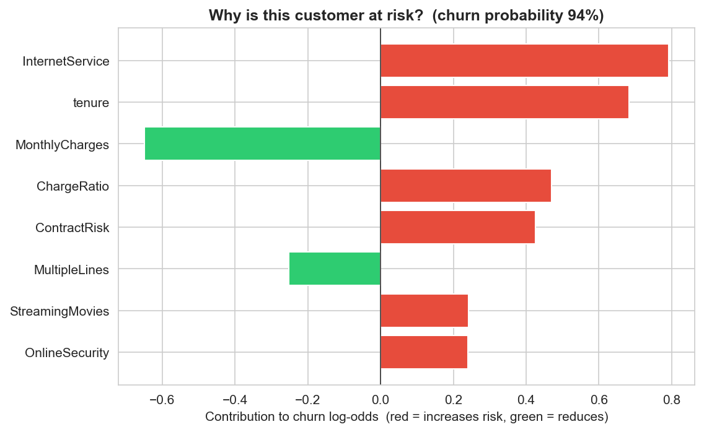
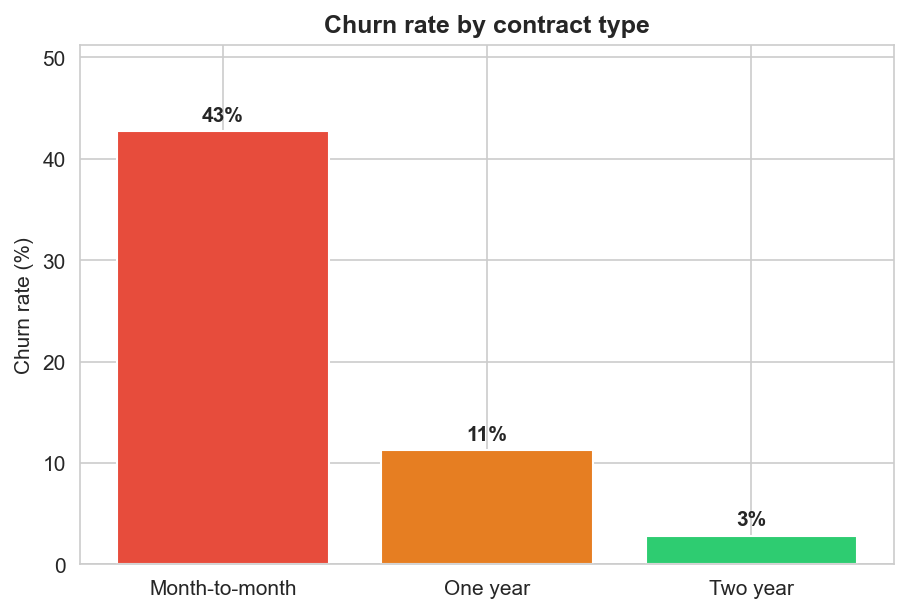
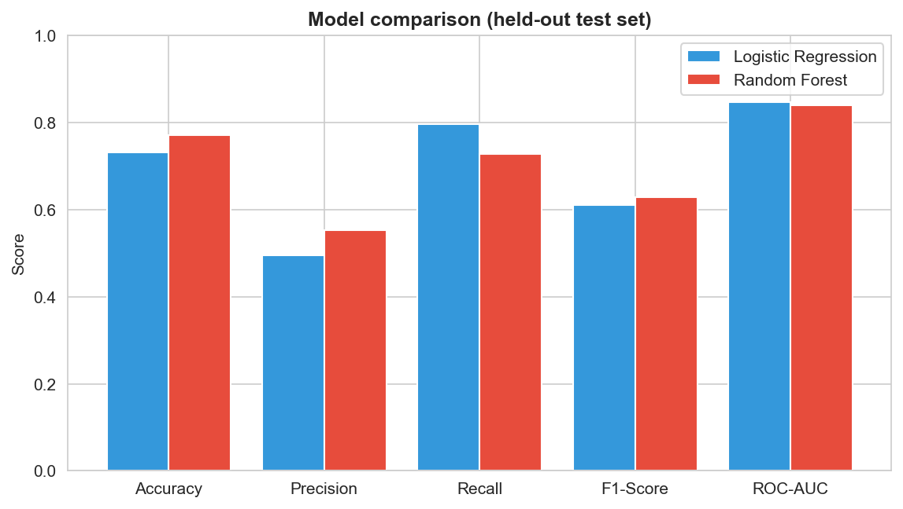
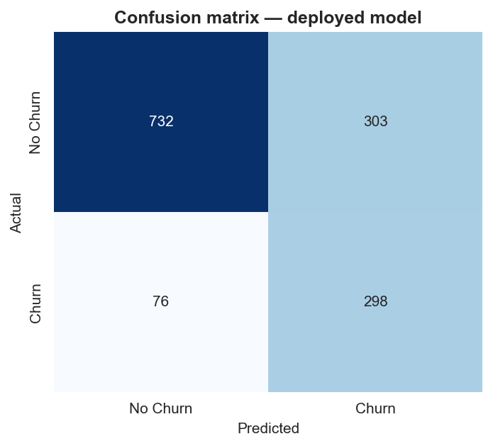
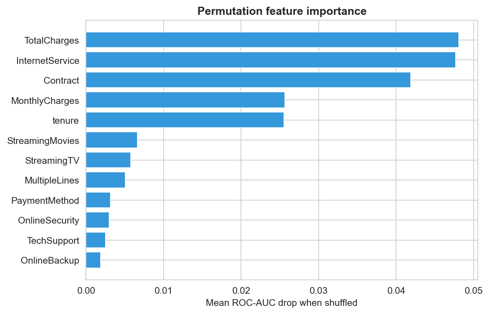

# Customer Churn Prediction

End-to-end machine-learning project that predicts telecom customer churn and serves predictions through an interactive Streamlit app and a FastAPI service.


[](https://github.com/dinfalabs/customer-churn-prediction/actions/workflows/ci.yml)


[](https://share.streamlit.io/deploy?repository=dinfalabs/customer-churn-prediction&branch=main&mainModule=app.py)

> **Status:** working demo / portfolio project. The model is trained and evaluated on the real Telco dataset (ROC-AUC ≈ 0.85). Deploy your own copy in one click with the badge above.

### 🛠️ Case study: from a broken model to ROC-AUC 0.85

This project began as an **audit**. The originally shipped model was *non-functional* — trained on synthetic random data, it predicted "No Churn" for **every** customer, while a train/serve bug silently dropped 5 of the app's inputs. A refactor (real data + a single fit-once / serve-once pipeline) fixed it:

| Metric (real test set) | Before | After |
|---|---|---|
| ROC-AUC | 0.49 (random) | **0.847** |
| Recall (churners caught) | 0.00 | **0.797** |
| F1-score | 0.00 | **0.611** |
| Customers flagged as churn | 0 / 7,043 | realistic |

Every prediction ships with a **per-customer explanation** (exact linear SHAP values):



---

## 📋 Table of Contents
- [Overview](#-overview)
- [Dataset](#-dataset)
- [Project Structure](#-project-structure)
- [Architecture](#-architecture)
- [Visuals](#-visuals)
- [Installation](#-installation)
- [Usage](#-usage)
- [API Service](#-api-service)
- [Deployment](#-deployment)
- [Model Performance](#-model-performance)
- [Business Impact](#-business-impact)
- [Key Churn Drivers](#-key-churn-drivers)
- [Testing](#-testing)
- [Roadmap](#-roadmap)
- [Author & License](#-author--license)

---

## 🎯 Overview

Telecom companies lose significant revenue to churn. Identifying at-risk customers **before** they leave enables targeted retention. This project covers the full ML lifecycle:

- **Data**: loading, validation (with a guardrail against synthetic data), cleaning
- **Modeling**: a single scikit-learn `Pipeline` (feature engineering + preprocessing + classifier) fitted once and reused for inference — no train/serve skew
- **Selection**: cross-validation on the training split only (the test set is touched once)
- **App**: a Streamlit UI with two modes — explore the Telco demo, or **upload your own dataset** to train a fresh model in-browser

---

## 📊 Dataset

[Telco Customer Churn](https://www.kaggle.com/blastchar/telco-customer-churn) (IBM sample data):

- **7,043** customer records, **19** input features + binary `Churn` target
- **Churn rate ≈ 26.5%** (imbalanced) — handled with `class_weight`
- 11 blank `TotalCharges` values are coerced to `NaN` and imputed **inside** the pipeline

> The dataset is a required input — `load_telco_data()` raises if it is missing or looks synthetic. Download the CSV and place it at `data/WA_Fn-UseC_-_Telco_Customer_Churn.csv`.

Feature groups: demographics (`gender`, `SeniorCitizen`, `Partner`, `Dependents`), account (`tenure`, `Contract`, `PaperlessBilling`, `PaymentMethod`), services (`PhoneService`, `MultipleLines`, `InternetService`, `OnlineSecurity`, `OnlineBackup`, `DeviceProtection`, `TechSupport`, `StreamingTV`, `StreamingMovies`), billing (`MonthlyCharges`, `TotalCharges`).

---

## 📁 Project Structure

```
customer-churn-prediction/
├── app.py                     # Streamlit web application
├── train_model.py             # Training pipeline -> models/ + reports/
├── requirements.txt
├── data/
│   └── WA_Fn-UseC_-_Telco_Customer_Churn.csv
├── src/
│   ├── data_loader.py         # load (+ synthetic-data guardrail), clean, validate
│   ├── feature_engineering.py # target separation + derived features
│   ├── pipeline.py            # the single fit-once / serve-once Pipeline
│   └── config.py              # configuration constants
├── models/
│   ├── churn_pipeline.pkl     # serialized end-to-end pipeline (the only artifact app.py loads)
│   └── metadata.json          # model name, metrics, sklearn version, timestamp
├── reports/
│   ├── model_comparison.csv   # per-model test metrics
│   └── feature_importance.csv # permutation importance (top 15)
├── notebooks/
│   ├── 01_EDA.ipynb
│   └── 02_Model_Training.ipynb  # mirrors train_model.py using the pipeline
├── service/                   # FastAPI scoring service (main.py)
├── tests/                     # pytest: feature eng, guards, perf gate, API
├── Dockerfile                 # container image for the API
└── .github/workflows/ci.yml   # CI: install deps + run pytest
```

---

## 🏗️ Architecture

The core design decision is **one pipeline object** that owns the entire transformation chain:

```
FeatureEngineer  →  ColumnTransformer( numeric: impute + scale | categorical: impute + one-hot )  →  classifier
```

It is fitted once in `train_model.py` and serialized as `models/churn_pipeline.pkl`. Both the app and any consumer call `pipeline.predict_proba(raw_dataframe)` — feature engineering, encoding and scaling all happen **inside** the fitted object. Because nothing is re-fitted at inference time, training and serving are guaranteed to transform inputs identically, and `OneHotEncoder(handle_unknown="ignore")` keeps single-row / unseen categories safe.

---

## 📸 Visuals

| Churn rate by contract | Model comparison |
|:---:|:---:|
|  |  |

| Confusion matrix (deployed model) | Permutation feature importance |
|:---:|:---:|
|  |  |

*All figures are reproducible: `python scripts/generate_figures.py`.*

---

## 🚀 Installation

```bash
git clone https://github.com/dinfalabs/customer-churn-prediction.git
cd customer-churn-prediction

python3 -m venv venv
source venv/bin/activate        # Windows: venv\Scripts\activate
pip install -r requirements.txt
```

Requires Python 3.11+. Pinned versions are in `requirements.txt` (kept in sync with the scikit-learn version used to serialize the model).

---

## 📖 Usage

### 1. Train the model

```bash
python train_model.py
```

Loads and cleans the data, selects the best model by 5-fold CV ROC-AUC, evaluates once on the held-out test set, and writes `models/churn_pipeline.pkl`, `models/metadata.json`, and the CSV reports.

### 2. Run the app

```bash
streamlit run app.py
```

The sidebar offers two modes:
- **🎯 Demo (Telco)** — five pages on the bundled model: Overview, Churn Insights, Make Prediction, Model Details, Data Overview.
- **📤 Your own data** — upload any CSV with a binary target; the app auto-detects feature types, applies guardrails, trains and compares models, then lets you predict and **download the trained pipeline**. No project-specific assumptions — it works on any churn-style dataset.

### 3. Score a customer in Python

```python
import joblib
import pandas as pd
from src.pipeline import FeatureEngineer  # import so joblib can unpickle the pipeline

pipeline = joblib.load("models/churn_pipeline.pkl")

customer = {
    "gender": "Female", "SeniorCitizen": 0, "Partner": "No", "Dependents": "No",
    "tenure": 2, "PhoneService": "Yes", "MultipleLines": "No",
    "InternetService": "Fiber optic", "OnlineSecurity": "No", "OnlineBackup": "No",
    "DeviceProtection": "No", "TechSupport": "No", "StreamingTV": "Yes",
    "StreamingMovies": "Yes", "Contract": "Month-to-month", "PaperlessBilling": "Yes",
    "PaymentMethod": "Electronic check", "MonthlyCharges": 95.0, "TotalCharges": 190.0,
}

proba = pipeline.predict_proba(pd.DataFrame([customer]))[0, 1]
print(f"Churn probability: {proba:.1%}")
```

---

## 🌐 API Service

A FastAPI service (`service/main.py`) exposes the same pipeline over HTTP.

```bash
# Local
uvicorn service.main:app --reload          # interactive docs at /docs

# Docker
docker build -t churn-api .
docker run -p 8000:8000 churn-api
```

| Method | Path | Description |
|---|---|---|
| `GET` | `/health` | Liveness + which model is loaded |
| `GET` | `/model` | Model metadata (metrics, version, timestamp) |
| `POST` | `/predict` | Score one customer |
| `POST` | `/predict/batch` | Score up to 1,000 customers |

Requests are validated with **Pydantic** (allowed categories + numeric ranges → automatic `422` on bad input):

```bash
curl -X POST http://127.0.0.1:8000/predict -H "Content-Type: application/json" -d '{
  "gender":"Male","SeniorCitizen":1,"Partner":"No","Dependents":"No","tenure":1,
  "PhoneService":"Yes","MultipleLines":"No","InternetService":"Fiber optic",
  "OnlineSecurity":"No","OnlineBackup":"No","DeviceProtection":"No","TechSupport":"No",
  "StreamingTV":"Yes","StreamingMovies":"Yes","Contract":"Month-to-month",
  "PaperlessBilling":"Yes","PaymentMethod":"Electronic check",
  "MonthlyCharges":95.0,"TotalCharges":190.0
}'
# -> {"churn":true,"churn_probability":0.9388,"risk":"high"}
```

---

## ▶️ Deployment

**Streamlit Community Cloud (free, ~2 minutes):**
1. Push this repo to GitHub.
2. Go to [share.streamlit.io](https://share.streamlit.io) → **New app** → select this repo, branch `main`, main file `app.py`.
3. Under *Advanced settings* pick Python 3.12+, then **Deploy**.

The app loads the committed `models/churn_pipeline.pkl`, so no training runs on the server. The "Open in Streamlit" badge at the top pre-fills this form.

**API via Docker (any container host):**
```bash
docker build -t churn-api .
docker run -p 8000:8000 churn-api      # then POST to http://localhost:8000/predict
```

---

## 📈 Model Performance

Measured on the held-out 20% test set (1,409 customers). Two models are trained; the best is selected by **cross-validated ROC-AUC on the training split** (no test leakage).

| Model | Accuracy | Precision | Recall | F1 | ROC-AUC |
|---|---|---|---|---|---|
| **Logistic Regression** ✅ | 0.731 | 0.496 | **0.797** | 0.611 | **0.847** |
| Random Forest | 0.771 | 0.553 | 0.727 | 0.628 | 0.840 |

✅ = deployed model. Logistic Regression wins on CV ROC-AUC (0.851 vs 0.845) and offers the **highest recall (0.80)** — for churn, catching customers who will actually leave is usually the priority, so recall is weighted heavily. The non-regression test gate requires ROC-AUC ≥ 0.78 and recall ≥ 0.45.

*Exact numbers come from `models/metadata.json` / `reports/model_comparison.csv`, regenerated on every `train_model.py` run.*

---

## 💰 Business Impact

Why recall matters in money terms (illustrative — plug in your own numbers):

- Base: **7,043** customers, churn ≈ **26.5%** → ~**1,869** churners/year.
- The model surfaces **~80%** of them (~1,490) *before* they leave, so retention budget targets only flagged high-risk customers instead of the whole base.
- Average revenue ≈ **$777/customer/year** (avg monthly charge × 12).
- If a targeted campaign retains just **30%** of the true at-risk customers it reaches:

  > `0.30 × 1,490 × $777 ≈ $347k/year` of revenue protected (before campaign cost).

The exact figure isn't the point — the model turns an undifferentiated retention budget into **targeted, measurable spend**.

---

## 💡 Key Churn Drivers

Top features by **permutation importance** (mean ROC-AUC drop when shuffled):

1. **TotalCharges** & **tenure** — newer, lower-spend customers churn more
2. **InternetService** — fiber-optic customers churn at a much higher rate
3. **Contract** — month-to-month (~43%) vs two-year (~3%) churn
4. **MonthlyCharges** — higher monthly bills correlate with churn

**Retention takeaways:** incentivize longer contracts, invest in first-year onboarding, and investigate fiber-optic service/price satisfaction.

Beyond global drivers, every individual prediction comes with a **per-customer explanation** (exact linear SHAP values) — see the *"Why this prediction?"* panel in the app and `src/explain.py`.

---

## 🧪 Testing

```bash
pytest -q
```

21 tests covering:
- **Feature engineering** — `TotalServices`, `ContractRisk` mappings
- **Train/serve guard** — a high-risk profile must score clearly higher than a low-risk one (catches the input-dropping skew bug)
- **Performance gate** — reads `metadata.json` and fails if ROC-AUC < 0.78 or recall < 0.45 (catches a model that degenerates to the majority class)
- **API** — health, prediction shape, high-vs-low ordering, Pydantic validation (`422`), batch scoring
- **Explanations** — per-customer contributions reconstruct the predicted probability
- **AutoML / bring-your-own-data** — trains on a synthetic dataset, drops ID-like columns, enforces guardrails (min rows, binary target)

Continuous integration (`.github/workflows/ci.yml`) installs dependencies and runs the suite on every push and pull request.

---

## 🗺️ Roadmap

**Done**
- ✅ Real dataset + synthetic-data guardrail
- ✅ Single fit-once / serve-once pipeline (no train/serve skew)
- ✅ CV-based model selection, class-imbalance handling
- ✅ Non-regression test gate; notebook aligned to the pipeline
- ✅ FastAPI scoring service (`/predict`, `/predict/batch`) + Docker
- ✅ CI (GitHub Actions: pytest)
- ✅ Per-customer explanations (linear SHAP values)
- ✅ "Bring your own data" mode — train on any uploaded CSV (auto feature detection)

**Next**
- [ ] More algorithms (XGBoost / LightGBM) + hyperparameter search
- [ ] Model registry / versioning, drift detection, scheduled retraining
- [ ] Linting in CI (ruff + black)

---

## 👤 Author & License

**Davide Infantino** — [@dinfalabs](https://github.com/dinfalabs)
Repository: https://github.com/dinfalabs/customer-churn-prediction

Licensed under the **MIT License** — see [LICENSE](LICENSE).
Dataset: Telco Customer Churn (IBM sample data, via Kaggle).
